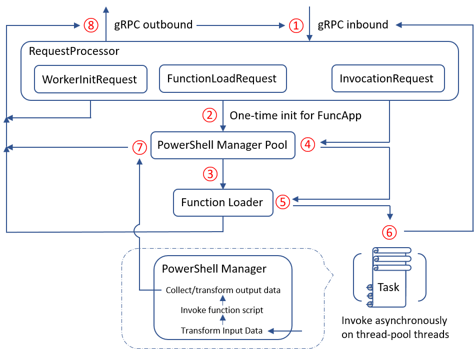
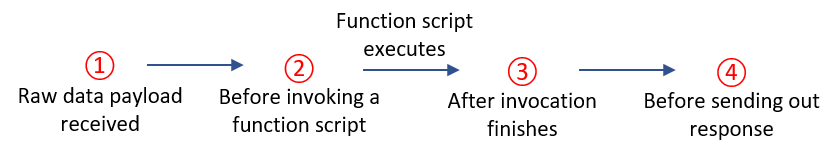

# PowerShell in Azure Functions

## Table of Content

- [Introduction](#introduction)
- [Design Goals](#design-goals)
- [An Execution Flow Tour](#an-execution-flow-tour)
- [Host Request Processing](#host-request-processing)
- [Intuitive User Experience](#intuitive-user-experience)
- [Concurrent Invocation of Functions](#concurrent-invocation-of-functions)
- [Managed Dependencies](#managed-dependencies)
- [Durable Functions Prototype](#durable-functions-prototype)

## Introduction

Azure Functions is a serverless compute service that allows users to run code on-demand without having to provision or manage infrastructure. This project is to enable PowerShell in Azure Functions 2.0 as a first-class citizen using the latest version of PowerShell Core.

Azure Functions 2.0 introduced a new language worker model to offer better language extensibility. Basically, the Functions runtime was split into the host and language worker processes. The host manages the function events in general, and the language worker process executes functions for a specific language. These two pieces communicate via [gRPC](https://grpc.io/) as the messaging layer using a well-defined contract written in [Protocol Buffers](https://developers.google.com/protocol-buffers/). To enable PowerShell in Azure Functions 2.0, a PowerShell language worker needs to be implemented, and this document discusses its design.

## Design Goals

- **Implement the worker side contract to receive, process and respond to requests from the host.** The worker process must create a gRPC client to connect to the gRPC server in the host process. That establishes a bidirectional channel for sending/receiving requests and responses between the host and worker processes.
- **Expose the Functions concepts with an intuitive experience that is familiar to PowerShell users.** This includes how to deal with Functions input/output bindings in the PowerShell way; what implicit type casting is needed for the input/output data; how to offer the Functions logging capability in a PowerShell friendly manner; how regular scripts (.ps1) and script modules (.psm1) fit in with the Functions, and more.
- **Support concurrent function execution within single PowerShell worker.** It's a requirement for a language worker to be able to handle concurrent function invocations. PowerShell is a single-threaded scripting language by default, but concurrency can be achieved by having multiple Runspaces in the same process.
- **Make it easy to extend the worker to support Durable Functions.** [Durable Functions](https://docs.microsoft.com/en-us/azure/azure-functions/durable/durable-functions-concepts) is an extension of Azure Functions that lets you write stateful functions in a serverless environment. It does so by managing state, checkpoints, and restarts for you. PowerShell worker doesn't support Durable Functions yet, but a prototype has been done to support its [Function Chaining](https://docs.microsoft.com/en-us/azure/azure-functions/durable/durable-functions-concepts#chaining) pattern.

## An Execution Flow Tour



Actions on the red nodes are described below

1. Read for the next incoming request.
2. Upon receiving the first _FunctionLoadRequest_, the worker performs a one-time initialization based on the Function App's metadata, to populate the pool with the first PowerShell Manager instance. The Function App's user profile '_profile.ps1_' will be executed in the PowerShell Manager's constructor.
3. Per every _FunctionLoadRequest_ received, the worker loads the metadata of the Function, including the function name and ID, script path, entry point name, input/output binding info, script parameters and more. The worker also does pre-validation by analyzing the script based on the binding info.
4. Per every _InvocationRequest_ received, the worker checks out a PowerShell Manager from the pool for the subsequent invocation. A PowerShell Manager manages a PowerShell Runspace and is responsible for invoking the script defined in a Function.
5. The worker retrieves the metadata of the Function from the Function Loader.
6. The worker creates a Task for doing the real invocation. The task will be scheduled on a thread-pool thread, and the worker's main thread will go on straightly to read for the next request, non-blockingly.
7. After an invocation, the PowerShell Manager used for the it will be reset and returned to the pool.
8. Write out the response to the host. (Logging is discussed later, which also goes through gRPC)

## Host Request Processing

Today, a language worker must receive and respond to three types of requests throughout its life-cycle: _WorkerInitRequest_, _FunctionLoadRequest_, and _InvocationRequest_.

> Some background context on the Function App. A Function App may consist of one or multiple functions, each being a sub-folder under the Function App root directory. A function must have a '[_function.json_](https://github.com/Azure/azure-functions-host/wiki/function.json)' present in its folder, which defines the location of the executable code as well as the input and output bindings for the function. A Function App has the 1:N mapping with the corresponding language worker - one language worker serves one Function App exclusively while one Function App could be served by multiple language workers due to auto-scale.

### WorkerInitRequest

The host process sends only one _WorkerInitRequest_ right after starting up the language worker process.  It's for the language worker to perform static initialization. The PowerShell worker simply returns a _WorkerInitResponse_ with the "OK" status upon receiving this request, because the static initialization is taken care of by constructors.

### FunctionLoadRequest

The host process sends a _FunctionLoadRequest_ for every function declared in a Function App. This request carries information about a specific function as well as the Function App. For each of such a request, the PowerShell worker will extract and save the function's metadata, perform some pre-validation on the function script based on the binding information received, and finally send back a _FunctionLoadResponse_ with the "OK" or "Fail" status depending on the pre-validation.

The pre-validation currently includes

1. Check if the function script has any parsing errors;
2. Check if there is 1-to-1 mapping between script parameters and output bindings (More about this requirement is discussed in the "Input and Output Binding" section below);
3. Check if the settings in 'function.json' are semantically supported by the PowerShell worker (More about this is discussed in the "scriptFile and entryPoint" section below).

Until the first _FunctionLoadRequest_ arrives, a language worker doesn't know anything about the Function App. For the PowerShell worker, there is some additional initialization that depends on the Function App root directory, including setting up some well-known paths and creating the first PowerShell Manager instance in the pool. This additional work is done upon receiving the first such request.

### InvocationRequest

The host process sends an _InvocationRequest_ every time a function is triggered to run. This request contains the ID of the function to be invoked, the input binding data, and the metadata about the trigger that fired this invocation. Upon receiving such a request, the PowerShell worker will retrieve the metadata about the function from the Function Loader using the function ID, and then check out an available PowerShell Manager instance from the PowerShell Manager Pool. After that, a task will be created to perform the real invocation asynchronously on a thread-pool thread, and the main thread is freed up to process the next incoming request.

The real invocation happens mainly in the PowerShell Manager. It transforms the input binding data to the appropriate types that are easy to work with in PowerShell, and then invokes the function script with the transformed value as arguments. Once the invocation finishes, it collects the results for the output bindings. The output results will then be converted to the pre-defined gRPC data type, and sent to the Host within an _InvocationResponse_.

## Intuitive User Experience

The top priority is to make PowerShell Functions offer an intuitive user experience that is already familiar to PowerShell users. To achieve this, concepts of Azure Functions need to be exposed in a PowerShell friendly way. Also, unique functionalities are added to PowerShell Functions due to its characteristics.

### scriptFile and entryPoint

The '_scriptFile_' and '_entryPoint_' are properties in '_function.json_' for referencing the code to run when a function is triggered - '_scriptFile_' points to the file that contains the code and '_entryPoint_' potentially points to an execution unit within the file, such as a method or function. They are not mandatory. By default, the host will look for a 'run.ps1' file under the function folder when the two properties are missing. If that file exists, the host will implicitly make '_scriptFile_' point to it and set '_entryPoint_' to an empty string, which means the 'run.ps1' itself should be invoked as a single execution unit.

The '_scriptFile_' can also point to a '.psm1' module file, with '_entryPoint_' pointing to a function defined in the module. In this case, when the PowerShell Azure Function is triggered, the module file will be loaded and then the function pointed by '_entryPoint_' will be invoked. This is very useful in a scenario where helper scripts are shared by the functions of the same Function App. Instead of having redundant copies of the shared scripts in multiple 'run.ps1' files under each function folder, all scripts can be put in a '.psm1' module file right under the Function App root, including the entry point functions and the helper functions. Then you just need to set the '_scriptFile_' and '_entryPoint_' properties in each of the '_function.json_' file to point to the script module file and the respective entry point functions. This helps reduce redundancy and make the PowerShell Azure Function scripts easy to be maintained.

In PowerShell, a '.ps1' script file is mostly a single execution unit by convention, while a '.psm1' module file, on the other hand, is a group of execution units (functions) for the purpose of reuse. Given that, the PowerShell language worker allows '_entryPoint_' to be specified only if '_scriptFile_' points to a '.psm1' module file. This is enforced by the pre-validation that happens in processing a _FunctionLoadRequest_.

The following are examples of two '_function.json_' files. The first one depends on the 'run.ps1' file existing in the same folder; the second one explicitly specifies the entry point function to run.

```json
// invoke 'run.ps1' by default

{
  "disabled": false,
  "bindings": [
    {
      "authLevel": "function",
      "type": "httpTrigger",
      "direction": "in",
      "name": "req",
      "methods": [
        "get",
        "post"
      ]
    },
    {
      "type": "http",
      "direction": "out",
      "name": "res"
    }
  ]
}
```

```json
// invoke a function in the module file

{
  "disabled": false,
  "scriptFile": "../azfunction.psm1",
  "entryPoint": "Run",
  "bindings": [
    {
      "authLevel": "function",
      "type": "httpTrigger",
      "direction": "in",
      "name": "req",
      "methods": [
        "get",
        "post"
      ]
    },
    {
      "type": "http",
      "direction": "out",
      "name": "res"
    }
  ]
}
```

### Input and Output binding

Input and output bindings are defined in the '_function.json_' file for every function within a Function App. The input bindings describe the trigger of the function and the additional data sources to be consumed by the function. The output bindings describe where the data produced from the function are to be sent or saved.

Naturally, input bindings are represented by parameters in a PowerShell Function script. A parameter is defined for each input binding of the function to accept the data payload, and the parameter name is the same as the input binding. Pre-validation during the processing of _FunctionLoadRequest_ makes sure there is 1-to-1 mapping between the script parameters and the output bindings_._ In addition, an _optional_ parameter named '_TriggerMetadata_' can be used for a function script to get the [metadata properties](https://docs.microsoft.com/en-us/azure/azure-functions/functions-bindings-expressions-patterns) about the trigger. Different triggers come with different metadata properties. For example, the blob trigger provides information about the URI of the incoming blob and [more](https://docs.microsoft.com/en-us/azure/azure-functions/functions-bindings-storage-blob).

For output bindings, Azure Functions allows the results to be passed out in two ways - implicitly via the 'return' statement of a language, or explicitly by associating the value with an output binding name. The former fits in with most languages naturally, but not PowerShell because of two characteristics of the PowerShell language:

1. **A 'return' statement is not the only place in PowerShell to actually return a result.** Unlike the other supported languages in Azure Functions, a PowerShell script can write results to the output stream at any point of the execution, via various ways, and the 'return' statement is just one of them. After invoking a PowerShell script, all objects in the output stream will be returned to the caller in a collection, and by then, there is no way to know which of them were actually from the 'return' statement.

1. **A collection object written to the output stream in PowerShell will be unraveled by default.** This means the output stream will end up with the elements of the collection, instead of the original collection object. This behavior is very convenient for chaining commands in pipeline, but in the Azure Functions context, the caller will lose the information about the real return type, which makes it hard to do the post data transformation properly aiming at the function's output target.

Given the ambiguity resulted by the 'return' in PowerShell, we decide to only support explicitly passing out output data from a PowerShell function script, _at least for now_. Two cmdlets are created to help with that: '_Push-OutputBinding_' and '_Get-OutputBinding_', and they are from the helper module we have for the PowerShell language worker: '_Microsoft.Azure.Functions.PowerShellWorker_'.

```powershell
Push-OutputBinding [-Name] <String> [-Value] <Object> [-Clobber] [<CommonParameters>]

Get-OutputBinding [[-Name] <String[]>] [-Purge] [<CommonParameters>]
```

Within the PowerShell function script, 'Push-OutputBinding -Name -Value' should be used to associate data with an output binding using the name. It basically saves the \&lt;Name, Value\&gt; pair in a Hashtable in the module. After the invocation of the script, the PowerShell worker will call 'Get-OutputBinding -Purge' to retrieve the output binding data and the '-Purge' parameter instructs to clean up the data afterwards, so no leftovers for the next function invocation.

The following is an example of a '_function.json_' file and the corresponding PowerShell function script.

```json
// function.json

{
  "disabled": false,
  "bindings": [
    {
      "authLevel": "function",
      "type": "httpTrigger",
      "direction": "in",
      "name": "req",
      "methods": [
        "get",
        "post"
      ]
    },
    {
      "type": "http",
      "direction": "out",
      "name": "res"
    }
  ]
}
```

```powershell
<#
   run.ps1
#>

# Trigger the function by running Invoke-RestMethod :
#   (via get method):  Invoke-RestMethod `
#                        -Uri http://localhost:7071/api/MyHttpTrigger?Name=Joe
#   (via post method): Invoke-RestMethod `
#                        -Uri http://localhost:7071/api/MyHttpTrigger `
#                        -Method Post `
#                        -Body (ConvertTo-Json @{ Name="Joe" }) `
#                        -Headers @{'Content-Type' = 'application/json' }`

# Input bindings are passed in via param block.
param($req, $TriggerMetadata)

# You can interact with query parameters, the body of the request, etc.
$name = $req.Query.Name
if (-not $name) { $name = $req.Body.Name }

$status = 200
$body = "Hello " + $name

# You associate values to output bindings by calling 'Push-OutputBinding'.
Push-OutputBinding -Name res -Value ([HttpResponseContext]@{
    StatusCode = $status
    Body = $body
})
```

### Data Transformation

Data received from the host are raw RPC data, so they must be converted to the proper types that make the most sense in the PowerShell context. Similarly, data produced by the Function script need to be converted to the raw RPC data before a response is sent on wire. There are two levels of data transformation. As is shown in the picture below, (1) and (4) are the more general type conversions between the RPC and .NET data, while (2) and (3) are more specific data conversions based on the parameter types of the to-be-invoked script and the input/output binding information.



Upon receiving the raw data, the conversion from RPC to .NET is shown in the following table.

| [incoming] RPC data type (.NET type) | [incoming] Result .NET data |
| --- | --- |
| JSON (string) | Hashtable **\***  via 'JsonObject.ConvertFromJson' |
| Bytes (ByteString) | byte[]       via 'ByteString.ToByteArray' |
| Stream (ByteString) | byte[]       via 'ByteString.ToByteArray' |
| Http (RpcHttp) | HttpRequestContext **\*** |
| String (string) | string (unchanged) |
| Double (double) | double (unchanged) |
| Int (long) | long (unchanged) |

**\*** For Json payload, the worker converts it to a Hashtable, using the same API that '_ConvertFrom-Json_' command depends on to ensure the consistent behavior. We choose to convert the json string to Hashtable instead of a PSObject based on two considerations:

1. Hashtable is lightweight. Its key-value pairs are accessible in the same way as object properties in PowerShell, and it's easy to work with directly in C#.
2. Though not common, the Json payload is possible to contain empty string keys or keys differ only in case. The keys can be preserved when converting to a case-sensitive Hashtable.

PowerShell is a case-insensitive language. To keep the consistent experience, the worker first tries to use a case-insensitive Hashtable, but will turn to a case-sensitive one when the attempt fails.

**\*** For the incoming Http payload, the worker extracts the metadata and constructs an immutable object of the type '_HttpRequestContext_', which is a custom type defined in the worker.

_Before sending out response_, the conversion from .NET to RPC is shown in the following table.

| [outgoing] .NET data | [outgoing] RPC data type (.NET type) |
| --- | --- |
| byte[] | Bytes (ByteString)  via 'ByteString.CopyFrom' |
| Stream | Stream (ByteString) via 'ByteString.FromStream' |
| string     when it's a valid Json string | JSON (string)       via 'JsonObject.ConvertToJson' |
| string     when it's NOT a valid Json string | String (string - unchanged) |
| HttpResponseContext **\*** | Http (RpcHttp) |
| double | Double (double) |
| long | Int (long) |
| int | Int (long)          via casting to long |
| All other objects | JSON (string)       via 'JsonObject.ConvertToJson' |

**\*** For http output binding, the PowerShell worker defines the custom type '_HttpResponseContext_' to represent the http response data. A '_RpcHttp_' object is then constructed using the response data.

_Before invoking a function script_, the input data may be further transformed based on the input binding information and the parameter type. Today, we take advantage of this step to allow the flexible consumption of blob input. When using a blob trigger, the blob content received is always '_Bytes_', even if the blob contains plain text only. If the corresponding parameter in the script is of the type '_string_', then we convert the byte array to a string using the UTF-8 encoding when passing argument for the invocation. Similarly, if the parameter type is '_Stream_', then the byte array will be wrapped into a '_MemoryStream_' before passed in as argument. Examples are shown as follows.

```powershell
<#
   run.ps1 - consume the blob content as string
   because the blob is in fact a JSON file
#>

param([string]$blobData, $TriggerMetadata)

$json = CovnertFrom-Json -InputObject $blobData
...
```

```powershell
<#
   run.ps1 - consume the blob content as Stream
   because the blob is actually a zip file
#>

param([IO.Stream]$blobData, $TriggerMetadata)

$zip = [IO.Compression.ZipArchive]::new($blobData)
...
```

_After the script invocation finishes_, the produced output data may be transformed properly to what the language worker expects based on the output binding information. By having this step, we allow the Hashtable to be used directly for the HTTP response output despite the worker expects an object of the type '_HttpResponseContext_'. After retrieving the output data, the worker validates the output for a HTTP response, and convert the result to '_HttpResponseContext_' as needed in this step. The difference in a function script is shown as follows.

```powershell
<#
   run.ps1 - no post-invocation data conversion
#>

param($req, $TriggerMetadata)

...

Push-OutputBinding -Name res -Value `
  ([HttpResponseContext]@{
      StatusCode = $status
      Body = $body
  })
```

```powershell
<#
   run.ps1 - with post-invocation data conversion
#>

param($req, $TriggerMetadata)

...

Push-OutputBinding -Name res -Value `
  @{
      StatusCode = $status
      Body = $body
  }
```

With more feedback, we can do more useful data conversions in (2) and (3) based on the parameter types and input/output bindings, which would further enhance the user experience.

### Logging in Functions

Azure Functions [supports 6 logging levels](https://docs.microsoft.com/en-us/azure/azure-functions/functions-monitoring#log-levels). In the new language worker model, logs are sent to the host by the language worker through the gRPC channel. In PowerShell, the logging capability is made available to the user's script by introducing the cmdlet '_Write-AzFuncLog_' to the helper module.

```powershell
Write-AzFuncLog [-Message] <string> [-Level] <string> [<CommonParameters>]
```

PowerShell users are already familiar with writing diagnostic messages to different PowerShell streams, via the convenient '_Write-\*_' cmdlets, such as '_Write-Error_', '_Write-Verbose_' and '_Write-Information_'. We want to keep the same experience in the PowerShell Azure Function, and we can do it by intercepting the PowerShell streams and sending records in the streams to the host as logs. By doing that, a user can use existing scripts in Azure Functions without worrying about the diagnostic messages get lost.

The following is a mapping between the PowerShell built-in '_Write-\*_' cmdlet and the log levels used for logging in PowerShell Azure Function.

| Write-\* cmdlet (the target stream) | Log level |
| --- | --- |
| Write-Verbose     (verbose stream) | Trace |
| Write-Progress    (progress stream) | Trace |
| Write-Debug       (debug stream) | Debug |
| Write-Information (information stream) | Information |
| Write-Host        (information stream) | Information |
| Write-Warning     (warning stream) | Warning |
| Write-Error       (error stream) | Error |
| Write-Output      (output stream) **\*** | Information |

**\*** The output stream is special in two folds:

1. Objects written to the output stream will be piped to the downstream command, if there is one.
2. When invoking a script, the invocation result is a collection of objects from the output stream.

As has been discussed in the "Input and Output Binding" section, the returned value of an invocation is currently not treated as the output binding value for a Function. But the objects written to the output stream are still valuable and should be made visible to the users. Therefore, we need to log the output objects using the default PowerShell formatting so that users will see the output objects displayed in the log in the same way as in a PowerShell console.

There are 2 requirements for logging the output object:

1. The logging of output objects should happen in a streaming manner. Namely, an object should be logged right after it's written to the output stream. This is required so that the logs can retain the same order of execution.
2. The output objects must remain in the output stream unchanged after being logged. Though not today, we may enable passing output binding value via 'return' in future with the proper semantics, so we still want to collect the returned values after the script invocation.

The solution is to introduce another cmdlet '_Trace-PipelineObject_' to the helper module, which behaves similarly to '_Tee-Object_' by splitting the incoming pipeline objects to two directions.

```powershell
Trace-PipelineObject [-InputObject] <Object> [<CommonParameters>]
```

When getting a pipeline object from the upstream command, '_Trace-PipelineObject_' first pushes the object through a steppable pipeline that is an equivalent of '_Out-String | Write-Information_'. '_Out-String_' will convert the object to a string using the default PowerShell formatting. '_Write-Information_' will then log the string with the '_information_' log level. After processing with the steppable pipeline, '_Trace-PipelineObject_' writes the pipeline object back to the output stream intact.

> Note that, even though '_Trace-PipelineObject'_ is exposed from the helper module, it is used by the language worker and not supposed to be invoked by users directly in their function scripts. It doesn't do any harm when used directly in a function script, but also doesn't do anything meaningful.

With the help of '_Trace-PipelineObject_', all that the PowerShell language worker needs is to chain '_Trace-PipelineObject_' after the Function script in a pipeline before the invocation. The following is an example to show the streaming logging for objects written to the output stream.

```powershell
<#
   run.ps1 - Write output between verbose logging
#>

# Input bindings are passed in via param block.
param($req, $TriggerMetadata)

Write-Verbose "Start to invoke ..." -Verbose

Get-Process | Select-Object -First 5

# You can interact with query parameters, the body of the request, etc.
$name = $req.Query.Name
if (-not $name) { $name = $req.Body.Name }

Write-Verbose "Name passed in: $name." -Verbose

# You associate values to output bindings by calling 'Push-OutputBinding'.
Push-OutputBinding -Name res -Value ([HttpResponseContext]@{
    StatusCode = 200
    Body = $body
})
```

```output
// Verbose and output logs are in the order of execution

Executing 'Functions.MyHttpTrigger' (Reason='This function was programmatically called via the host APIs.', Id=2242c6a8-a5a6-4156-813d-71fda654210b)
VERBOSE: Start to invoke ...
OUTPUT:
OUTPUT:  NPM(K)    PM(M)      WS(M)     CPU(s)      Id  SI ProcessName
OUTPUT:  ------    -----      -----     ------      --  -- -----------
OUTPUT:      57    34.80      26.57     615.28   11060   1 AlertusDesktopAlert
OUTPUT:      24    15.88      21.28       4.83   14672   1 ApplicationFrameHost
OUTPUT:       8     2.12       6.92       0.00    9988   0 AppVShNotify
OUTPUT:      17     3.43       8.65       0.00    4556   0 armsvc
OUTPUT:      44    95.29      97.70      42.31  880312   1 AzureStorageEmulator
VERBOSE: Name passed in: joe.
Executed 'Functions.MyHttpTrigger' (Succeeded, Id=2242c6a8-a5a6-4156-813d-71fda654210b)
```

### Module Path

The '_PSModulePath_' environment variable stores the paths to the locations of modules that are installed on the disk. PowerShell uses this variable to locate modules during operations like module loading and command auto-discovery. The default module path used by the PowerShell language worker consists of two directory paths: 'func-app-module-folder;worker-module-folder'

1. Function App module folder - the folder '_Modules_' right under the Function App root directory.
2. Worker module folder - the folder '_Modules_' right under the application base of the worker.

As of today, a few modules are bundled with the PowerShell language worker in the worker-level module folder, including the PowerShell built-in modules, the worker helper module, and '_ThreadJob_'. A PowerShell Function App can bundle extra modules itself, in the Function App module folder.

### Function App Profile

Like many other shell languages, PowerShell has the concept of the user profile, which is a '_profile.ps1_' file that runs on the startup of PowerShell to do some user specific initialization in the session. It's a very convenient feature for running some preparation code that is pre-requisite for all subsequent work. The profile concept is familiar to PowerShell users and would also be useful in Azure Functions scenarios.

For example, a recent update of Azure PowerShell module renamed all the Azure PowerShell cmdlets to replace the 'AzureRm' prefix with 'Az', such as '_Login-AzAccount_'. At the meantime, a new cmdlet '_Enable-AzureRmAlias_' was added to make the original names aliases of the new names, so that existing scripts that use the old names can work without changes as long as '_Enable-AzureRmAlias_' is called beforehand. In case that functions of a PowerShell Function App uses existing scripts that depend on the old Azure cmdlet names, '_Enable-AzureRmAlias_' has to be placed at the beginning of every 'run.ps1' of those functions, which is redundant and cumbersome. A user profile would be the perfect place for running the one-time pre-requisite code like '_Enable-AzureRmAlias_'.

In a PowerShell Function App, a 'profile.ps1' file can be optionally placed right under the Function App folder. If the file exists, it will be executed by a PowerShell Manager instance during its instantiation so that the user-specific initialization can be done in the associated Runspace. When there are multiple PowerShell Manager instances in the pool, 'profile.ps1' will be executed multiple times, once per a PowerShell Manager.

The following is an example of the profile that we use as a template.

```powershell
# Azure Functions profile.ps1
#
# This profile.ps1 will get executed every "cold start" of your Function App.
# "cold start" occurs when:
#
# * A Function App starts up for the very first time
# * A Function App starts up after being de-allocated due to inactivity
#
# You can define helper functions, run commands, or specify environment variables
# NOTE: any variables defined that are not environment variables will get reset after the first execution

# Authenticate with Azure PowerShell using MSI.
# Remove this if you are not planning on using MSI or Azure PowerShell.
if ($env:MSI_SECRET -and (Get-Module -ListAvailable Az.Accounts)) {
    Connect-AzAccount -Identity
}

# Uncomment the next line to enable legacy AzureRm alias in Azure PowerShell.
# Enable-AzureRmAlias

# You can also define functions or aliases that can be referenced in any of your PowerShell functions.
```

## Concurrent Invocation of Functions

When a PowerShell script is invoked, it runs on a single thread within a Runspace. Every PowerShell Manager instance wraps a Runspace and it can invoke only one script at a time. To support concurrent invocations, the PowerShell language worker has a PowerShell Manager Pool, which hosts reusable PowerShell Manager instances.

The default pool size is currently one, but it's configurable through an environment variable named '_PSWorkerInProcConcurrencyUpperBound_', which the user can set in the Application Settings of a Function App. PowerShell Manager instances are created in the pool in a lazy way. It starts with one PowerShell Manager instance initially. Upon receiving an _InvocationRequest_, the worker's main thread will try checking out a PowerShell Manager instance from the pool for the subsequent invocation. At this point, if the pool has no available instance and it hasn't reached its size limit, then a new PowerShell Manager instance will be created and returned from the pool. In this way, additional resources are allocated only if it's necessary.

Once a PowerShell Manager instance is checked out, the worker's main thread will create a task with it for the actual invocation, which will happen in a thread-pool thread. The worker's main thread itself will immediately go processing the next incoming request. After the function invocation is done, the PowerShell Manager instance will be reset and reclaimed by the pool, waiting to be checked out again for the next invocation.

Note that, checking out a PowerShell Manager instance from the pool is a blocking operation. When the number of concurrent invocations reaches the pool size, the worker's main thread will block on the checkout operation for the next invocation request until a PowerShell Manager instance becomes available. The initial design was to let the checkout operation happen in the thread-pool thread too, so the main thread would just create a task and go back processing the next request. However, it turned out to result in high lock contention due to too many tasks competing during the checkout operation. Therefore, the design was changed to make the checkout operation happen only in main thread, and a task gets created only after a PowerShell Manager instance becomes available.

## Managed Dependencies

### Problem

The goal is to let the user declare the dependencies required by functions, and rely on the service automatically locating and installing the dependencies from the PowerShell Gallery or other sources, taking care of selecting the proper versions, and automatically upgrading the dependencies to the latest versions (if allowed by the version specifications provided by the user).

Dependencies are declared in the _requirements.psd1_ file (_manifest_) as a collection of pairs (<_name_>, <_version specification_>). Currently, only _Az_ module is allowed, and the version specification should strictly match the following pattern: `<major version>.*`, so a typical manifest looks like this:

``` PowerShell
@{ 'Az' = '2.*' }
```

However, the design should accommodate multiple module entries and allow specifying exact versions.

Installing and upgrading dependencies should be performed automatically, without requiring any interaction with the user, and without interfering with the currently running functions. This represents an important design challenge. In a different context, dependencies could be stored on a single location on the file system, managed by regular PowerShell tools (`Install-Module`/`Save-Module`, `PSDepend`, etc.), while having the same file system location added to _PSModulePath_ to make all the modules available to scripts running on this machine. This is what PowerShell users normally do, and this approach looks attractive because it is simple and conventional. However, in the contexts where multiple independent workers load modules and execute scripts concurrently, and at the same time some module versions are being added, upgraded, or removed, this simple approach causes many known problems. The root causes of these problems are in the fundamentals of PowerShell and PowerShell modules design. The managed dependencies design in Azure Functions must take this into account. The problems will be solved if we satisfy the following conditions:

- **Only one writer at a time**. No concurrent executions of `Save-Module`, `PSDepend`, or anything else that could perform changes _on the same target file path_*_.
- **Atomic updates**. All workers executing a PowerShell script should always observe a state of dependency files that is a result of a _successful and complete_ execution of `Save-Module` or a similar tool. The workers should never observe any partial results.
- **Immutable view**. As soon as a set of dependency files is exposed to a worker for loading module purposes for the first time, this set of files should never change _during the life time of this worker._ Deletions, additions, or modifications are not acceptable.

### Solution

The main design idea is to partition the installed dependencies in such a way that every PowerShell worker gets exactly one complete and immutable set of dependencies for the lifetime of this worker (until restart). The same set of dependencies can be shared by multiple PowerShell workers, but each worker is strictly tied to a single set.

On the first function load request, the PowerShell worker reads the manifest and installs all the required dependencies into a dedicated folder on a file storage shared between all PowerShell workers within the function app. The subsequent function invocation requests are blocked until the installation of _all_ the dependencies is _completed successfully_. After the successful installation, the PowerShell worker insert the path of the folder to the '_PSModulePath_' variable of the PowerShell worker process, so that they become available to all functions running on this worker, and allows function invocation requests to proceed. The path to this folder is inserted into '_PSModulePath_' _before_ the `functionAppRoot\Modules` path, so that the managed dependencies folder is discovered first when modules are imported. This entire set of dependencies becomes an immutable _snapshot_: once created and exposed to PowerShell workers, it never changes: no modules or module versions are ever added to this snapshot or removed from this snapshot.

On the next function load request (normally received on a worker start), the worker reads the manifest and checks if the latest snapshot contains the dependencies satisfying the manifest. If the latest snapshot is _acceptable_, the worker makes '_PSModulePath_' point to this snapshot folder and allows the next function invocation proceed immediately. At the same time, the worker starts a background installation of all the dependencies into a new folder, which after successful completion becomes the latest snapshot. At this point, other starting workers will be able to find and use the new snapshot. The workers that were already running when the new snapshot was installed will be able to use it after restart.

A snapshot is considered _acceptable_ if it contains any version _allowed_ by the manifest for each required dependency. For example, Az 2.1 is allowed by the manifest containing `'Az' = '2.*'`, so the snapshot containing Az 2.1 will be considered acceptable, even if Az 2.2 is published on the PowerShell Gallery. As a result, the next function invocation will be allowed to proceed with Az 2.1 without waiting for any other Az version to be installed, and without even trying to contact the PowerShell Gallery for discovering the latest module version. All these activities can be performed in the background, without blocking function invocations.

However, if the latest snapshot is _not acceptable_ (i.e. it does not contain module versions required by the manifest), the worker starts installing the dependencies into a new snapshot, and all the subsequent function invocation requests are blocked, waiting for the new snapshot installation to complete.

When a snapshot installation starts, the dependencies are first installed into a folder with a name following a special pattern (`*.i`), so that this snapshot is not picked up by any worker prematurely, before the installation is complete. After _successful_ completion, the snapshot is _atomically promoted_ by renaming the folder to follow a different pattern (`*.r`), which indicates to other workers that this snapshot is ready to use. If the installation fails or cannot complete for any reason (for example, the worker restarts, crashes, or gets decommissioned), the folder stays in the installing state until removed.

Incomplete and old snapshots that are no longer in use are periodically removed from the file storage. In order to allow detecting unused snapshots, each PowerShell worker keeps "touching" a file named `.used` at the root of the used snapshot folder every `MDHeartbeatPeriod` minutes. Before and after installing any new snapshot, every PowerShell worker looks for unused snapshots by checking the folder creation time and the `.used` file modification time. If both these time values are older than (`MDHeartbeatPeriod` + `MDOldSnapshotHeartbeatMargin`) minutes, the snapshot is considered unused, so the PowerShell worker removes it. The latest `MDMinNumberOfSnapshotsToKeep` snapshots will never be removed, regardless of usage. (`MDHeartbeatPeriod`, `MDOldSnapshotHeartbeatMargin`, and `MDMinNumberOfSnapshotsToKeep` are environment variables configurable via Application Settings of a Function App.)

No other changes are ever performed to the snapshots that were once installed.

In this design, upgrading dependencies is conceptually decoupled from executing functions. Upgrading dependencies can be performed on any schedule by one or multiple agents, (almost) without any coordination between each other or with the workers executing functions. This allows us to make independent decisions on whether to run it from a separate service or keep it in PowerShell workers, and schedule the upgrade as often as we want. For now, upgrading dependencies is still performed by the PowerShell workers, just to avoid the overhead of deploying and maintaining a separate service. However, the design keeps this option open.

## Durable Functions Prototype

The [Durable Functions](https://docs.microsoft.com/en-us/azure/azure-functions/durable/durable-functions-concepts) is essentially the stateful workflow in a serverless environment. It consists of an orchestrator function and one or more activity functions. Durable Functions runs in a completely asynchronous way: the orchestrator function will stop after triggering an activity function, and later gets restarted once the activity function finishes execution. The actions of triggering activity functions and the activity function results will be saved along the way. After the orchestrator function is restarted, it replays the execution from the very beginning, but will skip the actions that are already done and use the results directly from the saved logs.

The Durable Functions targets five use patterns that usually require long-running jobs, and they are:

- Function Chaining - schedule and wait for jobs one by one.
- Fan-out/Fan-in - schedule jobs, then wait for all or any to finish.
- Async HTTP APIs - trigger a function by an HTTP call that returns a status endpoint for polling.
- Monitoring - flexible timer trigger that can manage its own life-cycle based on status change.
- Human Interaction - introduce "external event" for human interaction.

We had a prototype of Durable Functions in PowerShell worker to enable the '_Function Chaining_' pattern. A few problems we faced in the prototype were:

1. Allow the user to start an activity function from within the orchestration function.
2. Make the orchestrator function able to be stopped at certain point safely.
3. Make the PowerShell worker able to replay an orchestrator function, namely skipping the actions that are done in previous runs/replays based on the save logs.

They were solved by introducing the new cmdlet "_Invoke-ActivityFunctionAsync_" plus having the worker invoke the orchestrator function with the async PowerShell API.

Internally, the worker shares context information with the cmdlet, including _the existing saved logs_ sent from the host about the running orchestrator function and _a wait handler_ - let's call it A - which the cmdlet will set after it triggers an activity function. The async API used to start the orchestrator function returns _another wait handler_ - let's call it B - which will be set when the invocation finishes. Then the invoking thread will call '_WaitHandler.WaitAny_' on those two wait handlers.

- If the call to '_WaitAny_' returns because the wait handler A was set, then that means an activity function was just triggered, and the orchestrator function should be stopped now (it will be triggered again later after the activity function finishes). So, in this case, the invoking thread will stop the orchestrator function that is running asynchronously.
- If the call to '_WaitAny_' returns because the wait handler B was set, then that means the orchestrator function has run to its completion.

The cmdlet '_Invoke-ActivityFunctionAsync_' has the following syntax, the '_-FunctionName_' being the name of the activity function to invoke and '_-Input_' being the argument to the activity function.

```powershell
Invoke-ActivityFunctionAsync [-FunctionName] <string> [[-Input] <Object>] [<CommonParameters>]
```

When it's invoked to trigger an activity function, it first checks the existing logs shared by the worker to see if this invocation of the activity function has already done previously. If so, the cmdlet simply returns the result. If not, the cmdlet will

- trigger the activity function by sending a message to the host;
- set the wait handler shared by the worker to notify the worker that the activity function is triggered;
- wait on a private wait handler that will only be set when the '_StopProcessing_' method of the cmdlet is called. That method gets called only when the pipeline where this cmdlet is running in is being stopped.

The third step is very important in this stop-and-replay model of Durable Functions, because when stopping an invocation that is running asynchronously, we don't want that to interrupt arbitrary code execution that is happening in the pipeline. By having the cmdlet '_Invoke-ActivityFunctionAsync_' wait for '_StopProcessing_' to be called, we know for sure that the pipeline execution pauses at a safe place, ready for being stopped by the invoking thread.

The following is an example of PowerShell Durable Function that runs in the Function Chaining pattern:

```powershell
<#
   orchestrator function
#>

param($context)

$output = @()

$output += Invoke-ActivityFunctionAsync -FunctionName "E1_SayHello" -Input "Tokyo"
$output += Invoke-ActivityFunctionAsync -FunctionName "E1_SayHello" -Input "Seattle"
$output += Invoke-ActivityFunctionAsync -FunctionName "E1_SayHello" -Input "London"

return $output
```

```powershell
<#
   activity function
   E1_SayHello
#>

param($name)

return "Hello $name"
```

As you may notice, the above PowerShell Durable Function scripts use 'return'. This is because both the orchestrator and activity functions are special - they don't have output bindings and the returned value of invocation is the only way to pass states back to the host. This is why we mentioned in the "Input and Output Binding" section that the 'return' statement syntax for passing around output binding values is currently not supported, but may be considered in future with the appropriate semantics.

## Summary

This document discusses the design of the PowerShell language worker as in its status quo. This is an on-going project that just reached its second private preview. More iterations will be awaiting us to add new features. This document will be updated regularly with the progress of the project.
